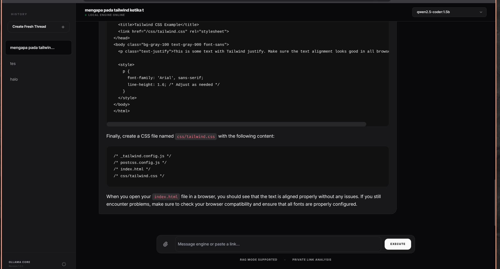
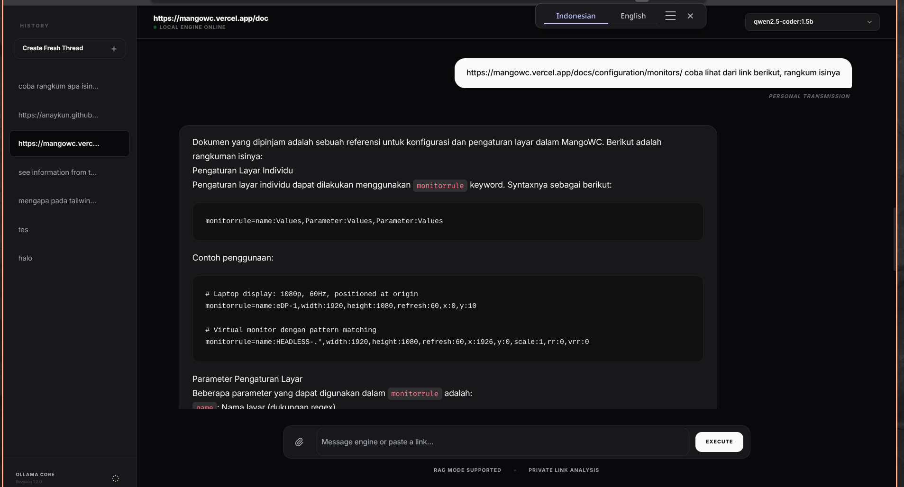
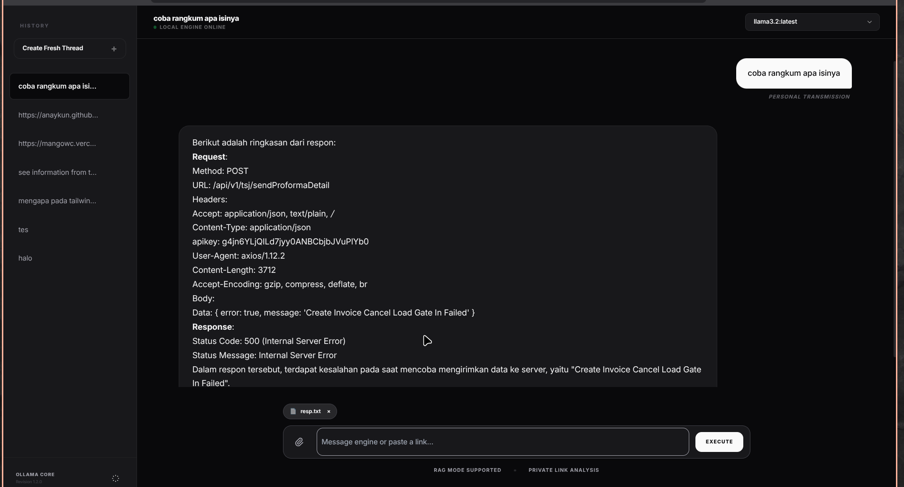

# 🧶 Ollama Interaction: Minimalist Zinc

A sophisticated, private, and minimalist web interface for interacting with local LLMs via **Ollama**. Designed with a "Zen" aesthetic and advanced RAG capabilities.


## ✨ Features

- 🌑 **Zinc Minimalist Design**: Premium monochromatic UI with smooth transitions and full dark/light mode support.
- 📂 **Local RAG (Retrieval-Augmented Generation)**: Attach documents (`.txt`, `.md`, etc.) to provide direct context to the model.
- 🔗 **Web Link Analysis**: Paste any URL to automatically process web content via Jina Reader integration.
- 🧠 **Smart Memory**: Maintains focus by remembering only the last 5 chat bubbles, ensuring speed and accuracy.
- 💾 **Local Persistence**: All chat history and threads are stored securely in your browser's `LocalStorage`.
- ⚡ **Zero Backend**: Pure frontend integration. No Node.js or Python server required.

## 🛠 Prerequisites

1. **Install Ollama**: Download and install from [ollama.com](https://ollama.com).
2. **CORS Configuration**: Since the UI runs in the browser, you must allow Ollama to accept requests from your local origin. 
   
   Run this in your terminal before starting Ollama:
   ```bash
   # For Linux/macOS
   export OLLAMA_ORIGINS="*"
   ollama serve
   ```

## 🚀 Getting Started

1. Clone the repository:
   ```bash
   git clone https://github.com/your-username/ollama-interaction.git
   ```
2. Open `index.html` in any modern web browser.
3. Select your model from the dropdown (make sure you have models pulled, e.g., `ollama pull llama3`).
4. Start chatting!

## 📄 How to use RAG

- **Attach Files**: Click the 📎 (Paperclip) icon to upload a text or code file. The AI will use it as a primary knowledge source.
- **Analyze Links**: Paste a full URL (starting with `http://` or `https://`) into the chat. The system will "read" the link and summarize/answer based on it.
- **Thread Management**: Use the sidebar to create new threads, rename them (✎), or delete (×) past conversations.

## 🖼 Screenshots




- **Chat Interface**: Clean threaded view with role-based alignment.
- **Context Chips**: Interactive chips for attached documents.

## ⚖️ License
This project is licensed under the MIT License - see the LICENSE file for details.

---
Built for speed, privacy, and aesthetic lovers. Enjoy your local AI experience! 🚀
